# 第 5 章 美食推荐系统设计与实现

## 5.1 系统概述

本章介绍实验统一使用的美食推荐系统。系统参考 SpringBoot+Vue.js 协同过滤算法美食推荐小程序的业务设计，并结合本文的研究对象进行整理。系统采用前后端分离架构，由用户端、管理员端、业务服务和数据存储组成，面向普通用户提供美食浏览、个性化推荐、购物车、订单、收藏、评论和资讯服务，面向管理员提供用户、分类、美食、资讯和订单维护功能。

需要说明的是，本系统中的协同过滤算法用于实现个性化推荐这一业务功能。第六章研究的是 AI 辅助开发过程中的流程约束、项目知识组织和任务上下文生成机制，不比较推荐算法本身的准确率。因此，本章关注系统的需求边界、架构、数据和功能实现，第六章再以该系统作为统一任务载体开展对比实验。

## 5.2 系统需求分析

### 5.2.1 系统角色与业务流程

系统包含管理员和普通用户两类角色。普通用户可以注册和登录系统，浏览或搜索美食，查看美食详情，接收推荐结果，将商品加入购物车并提交订单，也可以维护收货地址、收藏美食、发表评论、查看资讯和联系客服。管理员拥有后台管理权限，负责用户信息、美食分类、美食信息、资讯内容、订单和系统配置的维护。

普通用户的主要业务流程为：用户注册或登录系统后进入首页；系统根据用户行为和美食信息生成推荐结果；用户浏览详情并选择收藏、评论、加入购物车或直接购买；确认收货地址和商品数量后提交订单；订单在待付款、待发货、配送中和已完成等状态之间流转，完成后的评价行为作为后续偏好计算的输入。

管理员的主要流程为：管理员登录后台后进入管理首页，按权限访问用户管理、美食分类管理、美食信息管理、资讯管理和订单管理页面，对业务数据执行查询、新增、修改、删除和状态维护操作。

### 5.2.2 功能需求

系统功能需求如下：

1. 用户端应支持注册、登录、退出和个人资料维护，并对未登录用户限制订单、收藏等需要身份认证的操作。
2. 用户端应支持按名称和分类检索美食，展示名称、分类、图片、口味、详情、点击次数和价格等信息。
3. 首页应展示常规美食内容和个性化推荐内容，推荐结果应能追溯到用户行为或相似度计算依据。
4. 购物车应支持添加商品、修改数量、删除商品、清理失效商品和结算操作。
5. 订单模块应支持订单创建、地址选择、支付类型选择、订单状态查询和订单信息展示。
6. 用户应能够收藏美食、取消收藏、发表评论并查看评论回复。
7. 管理员应能够维护用户、美食分类、美食信息、资讯、客服和订单数据。

### 5.2.3 性能与安全需求

系统界面应保持操作路径清晰，在查询、登录、注册和提交订单等操作失败时返回明确提示。列表查询采用分页方式，避免一次返回过多记录；图片和详情内容按需加载，以降低用户端初始加载开销。

系统通过角色权限控制区分管理员和普通用户的操作范围。密码不以明文保存，登录后通过令牌识别用户身份；订单、地址和个人资料接口必须校验当前用户的访问权限。数据库服务不直接暴露到公网，生产部署时应通过服务端接口访问数据库，并对用户输入执行参数校验。

## 5.3 系统总体设计

### 5.3.1 总体架构

系统采用前后端分离的 B/S 架构。用户端采用 Uni-app 实现，可编译为微信小程序；管理员端采用 Vue 组件化页面实现；后端采用 Spring Boot 提供 REST 接口并组织用户、菜品、推荐、购物车和订单等业务服务；MySQL 保存业务数据，Redis 可用于缓存热点数据和会话信息，必要时使用 Elasticsearch 支持美食内容检索。系统结构如图5-1所示。

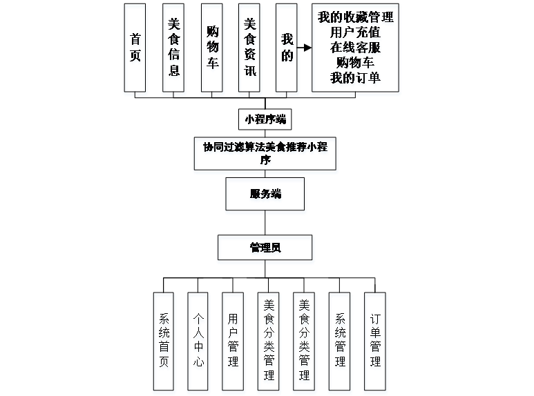

图5-1为参考文档中的系统功能结构图。结合本文系统，前端展示层负责页面和交互，业务层负责认证、推荐、订单和管理逻辑，持久层负责数据访问；推荐服务从用户行为、收藏、评论、点击和订单记录中构建偏好信息，并返回排序后的美食列表。

### 5.3.2 用户端与管理员端

用户端以移动端页面为主，底部导航包括首页、美食信息、购物车、资讯和我的等入口。管理员端以浏览器后台为主，采用侧边导航和表格管理页面，提供筛选、分页、编辑和删除等操作。两端通过统一的后端接口通信，权限由服务端统一判断。

管理员和用户的功能边界参考用例图如图5-2和图5-3所示。

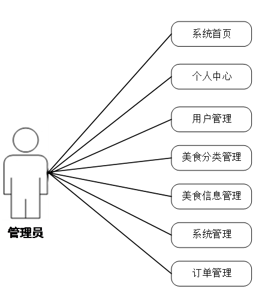

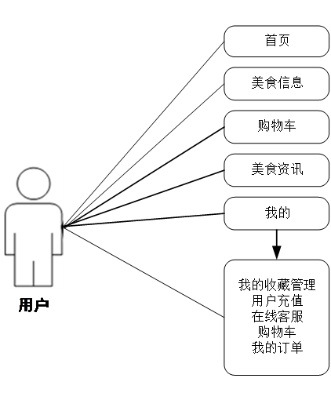

## 5.4 系统功能模块设计

### 5.4.1 用户端模块

用户端包括注册登录、首页推荐、美食信息、购物车、美食资讯和个人中心。注册页面采集账号、密码和基本资料；登录页面校验账号密码，登录成功后保存会话令牌。首页展示轮播内容、热门美食和个性化推荐；美食信息页面支持关键词搜索、分类筛选和详情查看；个人中心提供收藏、充值、客服和订单查询入口。

### 5.4.2 美食信息与推荐模块

美食信息模块维护名称、分类、图片、口味、详情、点击次数和价格等属性。用户进入详情页时记录点击行为，收藏、评论和订单行为也作为偏好证据保存。推荐模块在用户存在一定历史行为时使用协同过滤结果；冷启动用户则以热门度、分类偏好或最近更新内容作为补充排序依据。

### 5.4.3 购物车与订单模块

购物车记录用户、商品、数量、单价和会员价等信息，支持数量增减、删除和结算。订单创建时保存订单编号、商品快照、数量、原价、折扣价、总价、支付类型、收货地址和联系人信息，避免商品后续修改影响历史订单。订单状态由后端按照业务操作进行更新，用户端只展示当前用户有权查看的订单。

### 5.4.4 收藏、评论与资讯模块

收藏模块保存用户与美食之间的关联，用户可以在详情页添加或取消收藏，并在个人中心查看收藏列表。评论模块保存用户、美食、评论内容和回复内容，管理员可以对评论进行审核或回复。资讯模块保存标题、简介、封面图片和正文内容，管理员负责发布和维护，用户端负责浏览。

### 5.4.5 管理员模块

管理员登录后进入后台首页，可以维护用户、分类、美食、资讯和订单。用户管理页面支持按账号、姓名等条件查询并执行新增、编辑和删除；分类管理用于维护美食分类；美食信息管理维护名称、分类、图片、口味、详情、点击次数和价格；订单管理展示订单编号、商品、数量、价格、支付类型、状态、地址和收货人等信息。

## 5.5 数据库设计

### 5.5.1 概念结构

系统主要实体包括管理员、用户、美食分类、美食、购物车、订单、地址、收藏、评论、美食资讯和推荐记录。用户与购物车、订单、地址、收藏、评论和推荐记录是一对多关系；美食分类与美食是一对多关系；美食与收藏、评论、购物车、订单和推荐记录存在关联。管理员负责维护分类、美食、资讯和订单等实体。

管理员信息、用户信息、美食信息和订单信息实体示意分别如图5-4至图5-7所示。

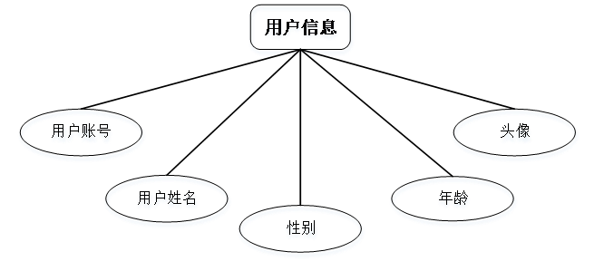

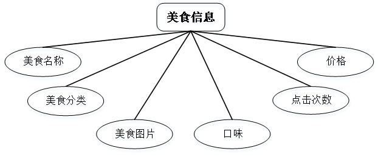

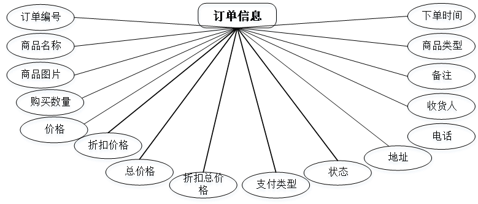

### 5.5.2 核心数据表

系统核心数据表如表5-1所示。具体字段应以当前项目数据库脚本和实体类为准，参考文档中的字段命名在实现时统一转换为项目采用的命名规范。

表5-1 系统核心数据表

| 数据表 | 主要作用 | 典型字段 |
|---|---|---|
| `admin` | 管理员账号与角色 | id、username、password、role、addtime |
| `user` | 普通用户及偏好基础信息 | id、account、name、gender、age、avatar、money |
| `food_category` | 美食分类 | id、name、addtime |
| `food` | 美食基本信息 | id、name、category_id、image、taste、detail、click_num、price |
| `cart` | 用户购物车 | id、user_id、food_id、quantity、price、discount_price |
| `address` | 收货地址 | id、user_id、address、receiver、phone、is_default |
| `order` | 订单及配送信息 | id、order_no、user_id、food_id、quantity、total、status、address |
| `favorite` | 用户收藏关系 | id、user_id、food_id、type、addtime |
| `comment` | 用户评论与管理员回复 | id、user_id、food_id、content、reply、addtime |
| `food_news` | 美食资讯 | id、title、introduction、picture、content |
| `recommend_record` | 推荐结果及来源追踪 | id、user_id、food_id、source、score、addtime |

## 5.6 协同过滤推荐算法实现

### 5.6.1 行为数据与偏好矩阵

系统将用户点击、收藏、评论、购买等行为转换为带权偏好值。设用户集合为 $U$，美食集合为 $F$，用户 $u$ 对美食 $f$ 的偏好得分为 $r_{u,f}$，则可将行为加权表示为：

$$
r_{u,f}=w_c c_{u,f}+w_f f_{u,f}+w_m m_{u,f}+w_o o_{u,f} \tag{5-1}
$$

其中 $c$、$f$、$m$、$o$ 分别表示点击、收藏、评论和购买行为，$w_c$、$w_f$、$w_m$、$w_o$ 为预先设定的行为权重。相同用户和美食的多次行为可以按时间衰减或次数上限进行归一化，避免单一行为长期主导推荐结果。

### 5.6.2 相似度计算与推荐生成

基于用户偏好向量计算用户之间的相似度，或基于美食被共同交互的用户集合计算美食之间的相似度。以余弦相似度为例，两个用户 $u_i$ 和 $u_j$ 的相似度为：

$$
sim(u_i,u_j)=\frac{\sum_f r_{u_i,f}r_{u_j,f}}{\sqrt{\sum_f r_{u_i,f}^2}\sqrt{\sum_f r_{u_j,f}^2}} \tag{5-2}
$$

系统选取与目标用户相似度较高的邻居，汇总邻居对目标用户尚未交互美食的偏好得分，形成候选集合并排序。推荐结果写入 `recommend_record`，用于结果追踪和后续分析。对于没有足够历史行为的新用户，系统采用热门美食和分类规则进行补充，保证首页仍有可展示内容。

## 5.7 系统主要功能实现

### 5.7.1 用户端页面

参考文档中的用户注册、登录、首页、美食信息、购物车和个人中心页面如图5-8至图5-13所示。这些图用于说明系统功能布局和业务入口；最终论文插图应根据当前项目实际运行界面更新。

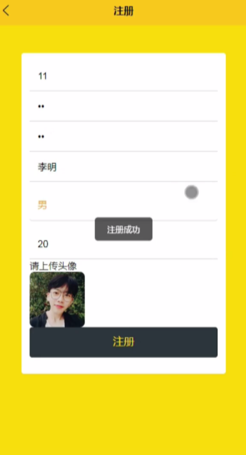

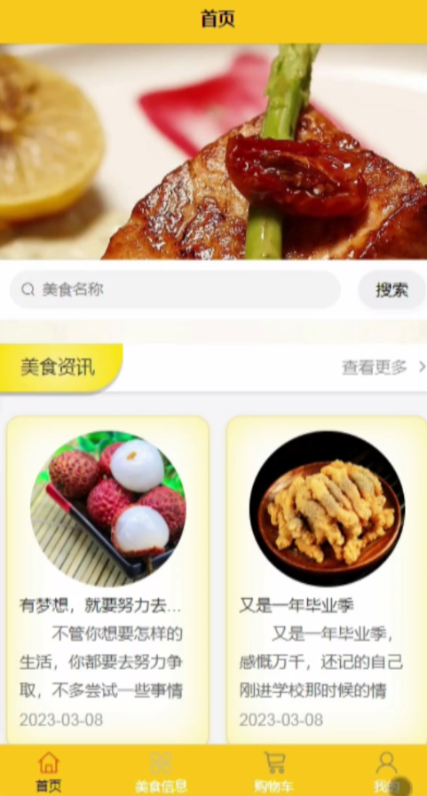

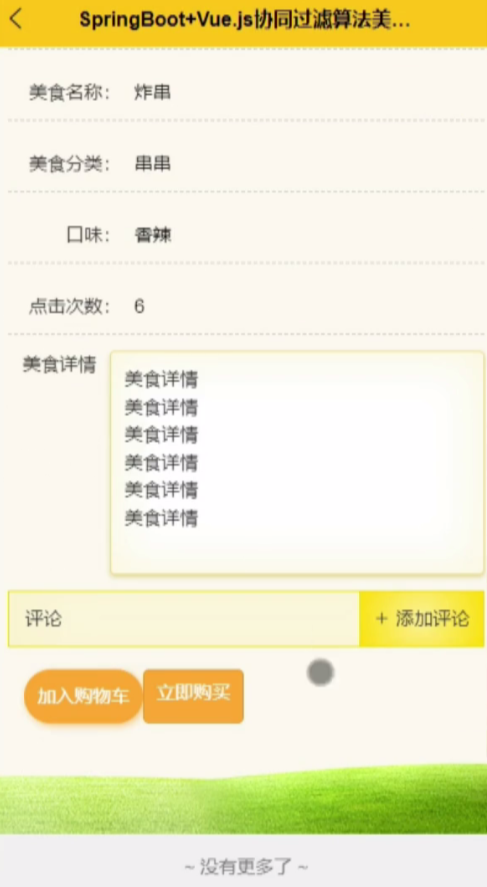

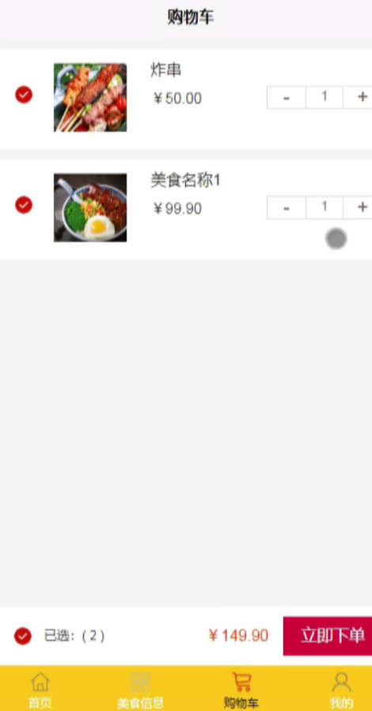

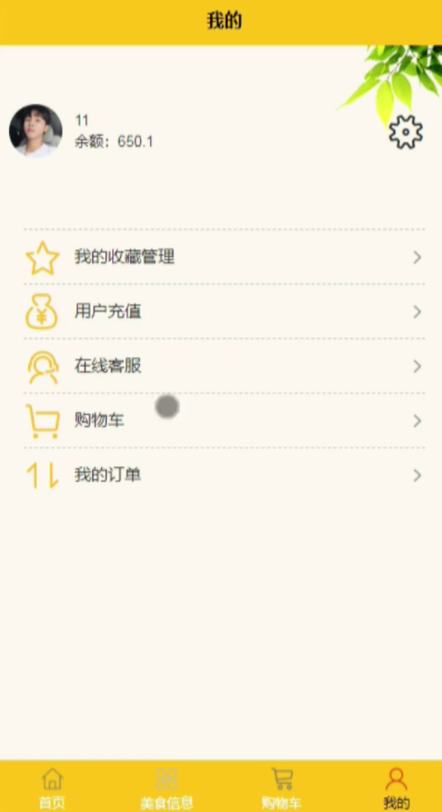

### 5.7.2 管理员端页面

管理员端页面包括登录、后台首页、用户管理、美食分类管理、美食信息管理、系统管理和订单管理，如图5-14至图5-20所示。后台页面均通过服务端接口读取数据，操作完成后刷新列表并返回成功或失败提示。

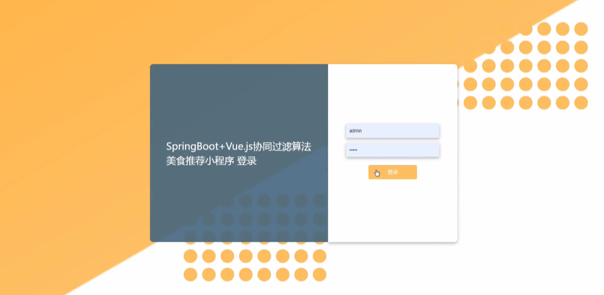

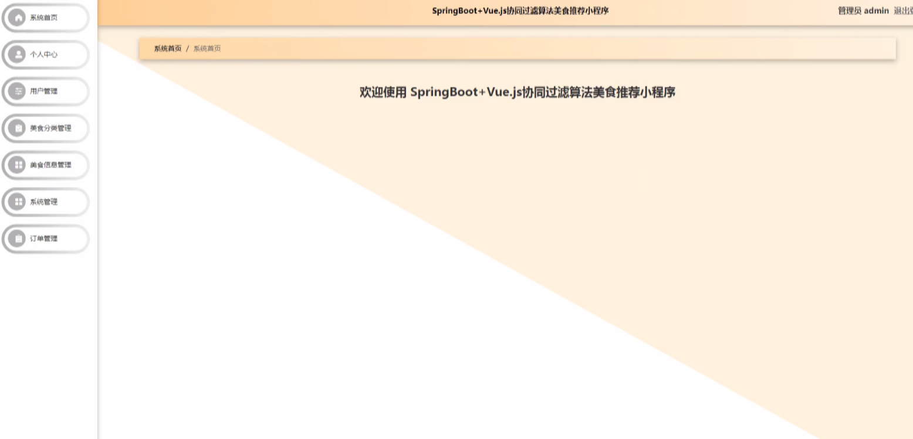

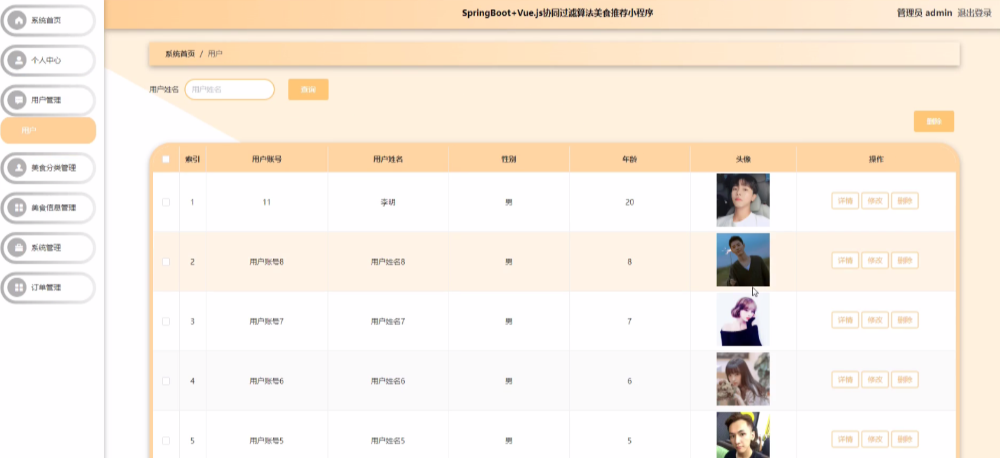

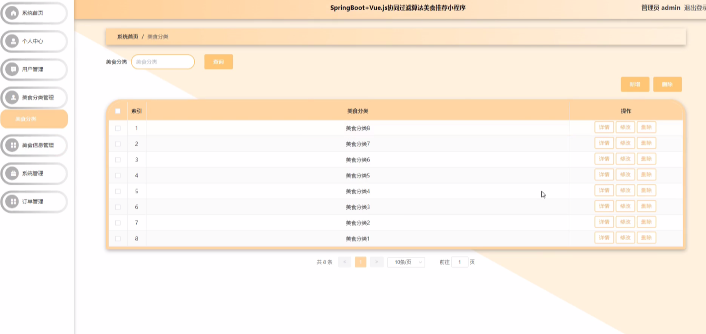

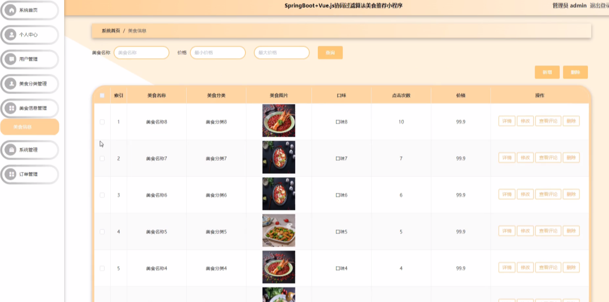

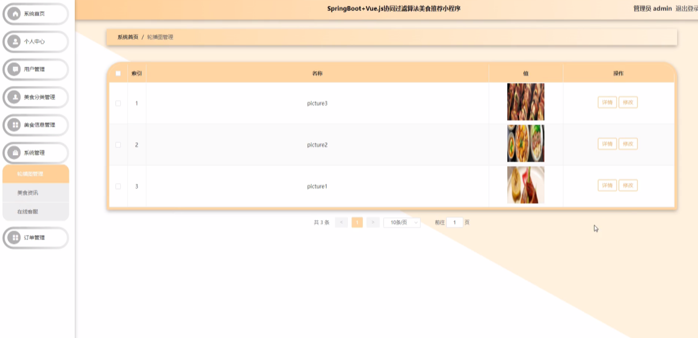

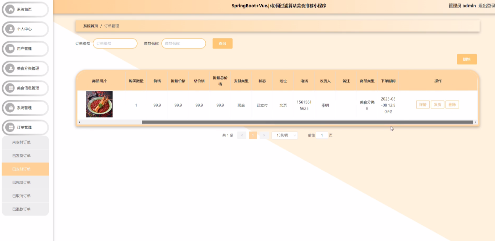

## 5.8 本章小结

本章基于参考系统整理了美食推荐系统的需求、架构、功能模块、数据库和协同过滤推荐流程，并给出了用户端和管理员端的主要页面。系统为第六章实验提供统一的需求边界、代码任务和运行环境。系统的推荐算法用于支撑真实业务场景，不作为上下文工程方法的比较对象；下一章将在共同 SDD 基础上比较 OpenSpec 与 wpw，并检验 KG 驱动上下文组织对开发成本、上下文相关性和任务实现效果的影响。
